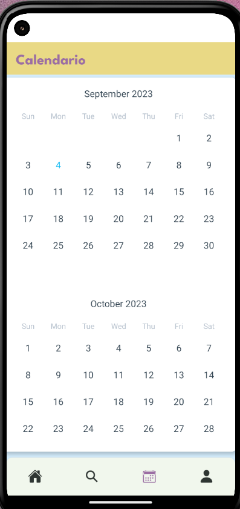

Mijovy es una app para encontrar nuevos Hobbies y lugares para realizarlos en tu ciudad.
Está destinada a aquellas personas que quieren encontrar esa actividad, ya sea artística, deportiva, o reacreativa y no saben dónde buscar.

En su menú principal, se encuentra una lista de los eventos próximos en la ciudad,
cargados por otros usuarios, y que para mayor comodidad, puedes vizuarlos a través del calendario de la app. 
Además, se encuentra un listado de las actividades agregadas por vos, en el caso de que seas una persona que ofrece algún servicio.
En esa lista, podrás visualizar y controlar mejor tus publicaciones.

En el apartado de Búsqueda, contás con el acceso a un mapa para echarle un vistazo a los centros recreativos
de tu ciudad. Y por otro lado, todas las actividades publicadas, divididas en categorías para hayarlas más fácilmente.

Por último, en el apartado de perfil, podrás encontrar tus datos personales, y agregar nuevas actividades si así lo deseas.

App construida con React Native en su totalidad. Con conexión a Firebase, y utilizando la librería Redux.

